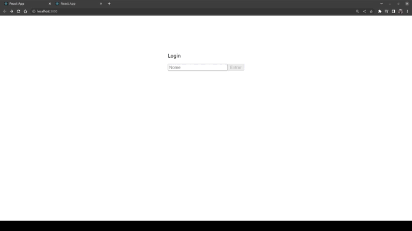
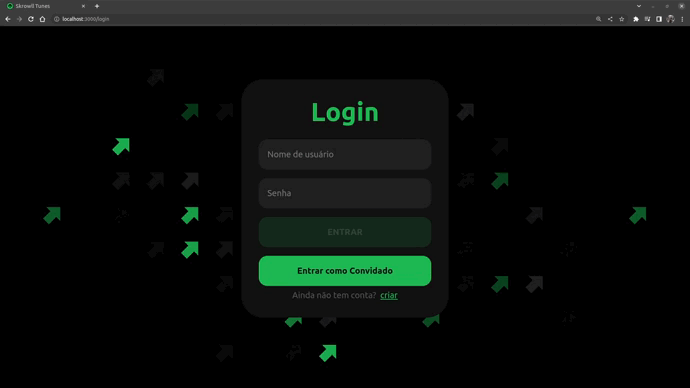

# TrybeTunes 🎧
# Boas vindas ao repositório do projeto TrybeTunes!
Este projeto consiste em uma aplicação criada para permitir que o usuário pesquise por álbuns musicais de um artista específico. Ao digitar o nome do artista na barra de pesquisa, o usuário verá uma lista de álbuns disponíveis e, ao clicar em um dos álbuns, poderá visualizar a lista de músicas correspondentes. Além disso, cada música terá uma prévia de 30 segundos para que o usuário possa escutá-la.
##### API utilizada: [iTunes](https://developer.apple.com/library/archive/documentation/AudioVideo/Conceptual/iTuneSearchAPI/index.html#//apple_ref/doc/uid/TP40017632-CH3-SW1)

# Sumário
- [Boas vindas ao repositório do projeto TrybeTunes!](#boas-vindas-ao-repositório-do-projeto-trybetunes)
- [Sumário](#sumário)
- [Habilidades desenvolvidas](#habilidades-desenvolvidas)
- [Tecnologias utilizadas](#tecnologias-utilizadas)
- [Prévia](#prévia)
- [Prévia da nova versão do projeto](#prévia-da-nova-versão)
- [Rodando na sua máquina](#rodando-na-sua-máquina)
- [Pré-requisitos](#pré-requisitos)
- [Instalação](#instalação)
# Habilidades desenvolvidas
  * Fazer requisições e consumir dados vindos de uma `API`;
  * Utilizar os ciclos de vida de um componente React;
  * Utilizar a função `setState` de forma a garantir que um determinado código só é executado após o estado ser atualizado
  * Utilizar o componente `BrowserRouter` corretamente;
  * Criar rotas, mapeando o caminho da URL com o componente correspondente, via `Route`;
  * Utilizar o `Switch` do `React Router`
  * Criar links de navegação na aplicação com o componente `Link`;
# Tecnologias utilizadas


# Prévia

# Prévia da nova versão


* Para acessar o repositório clique [Aqui](https://github.com/skrowll/project-skrowlltunes)
* Para acessar o site clique [Aqui](https://tunes.skrowll.online)

# Rodando na sua máquina
## Pré-requisitos
Antes de começar, você vai precisar ter instalado em sua máquina as seguintes ferramentas:
[Git](https://git-scm.com), [Node.js](https://nodejs.org/en/).
Além disto é bom ter um editor para trabalhar com o código como [VSCode](https://code.visualstudio.com/)
## Instalação
Clone esse repositório:
```
git clone https://github.com/skrowll/trybe-project-trybetunes.git
```
Entre na pasta do repositório que você acabou de clonar:
 ```
cd trybe-project-trybetunes
  ```
Instale as dependências:
 ```
npm install
  ```
Para rodar a aplicação:
  ```
npm start
  ```
###### Projeto desenvolvido durante o curso de Desenvolvimento Web da [Trybe](https://github.com/tryber).
